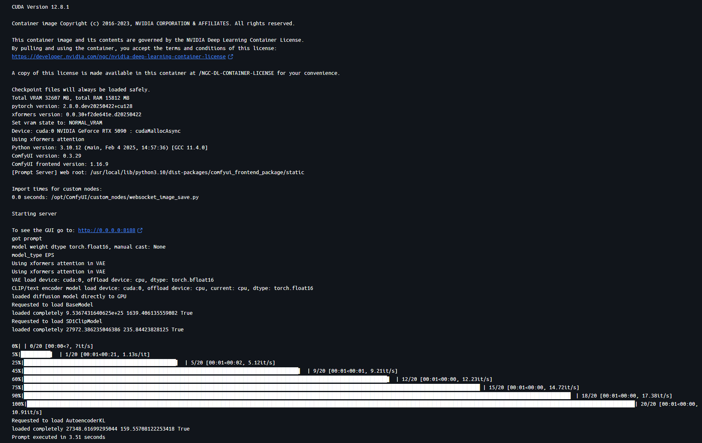
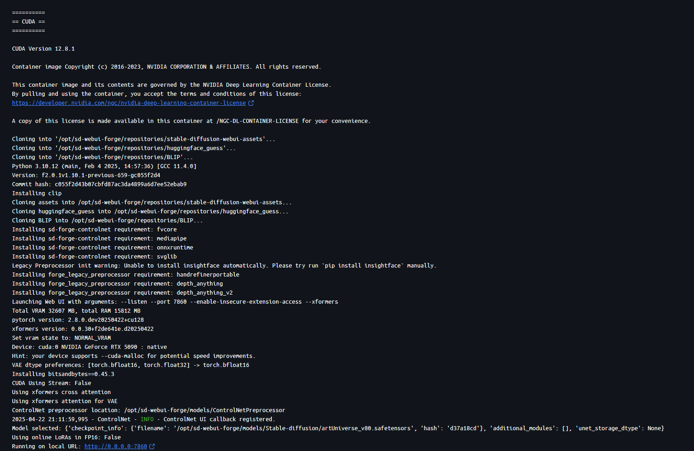
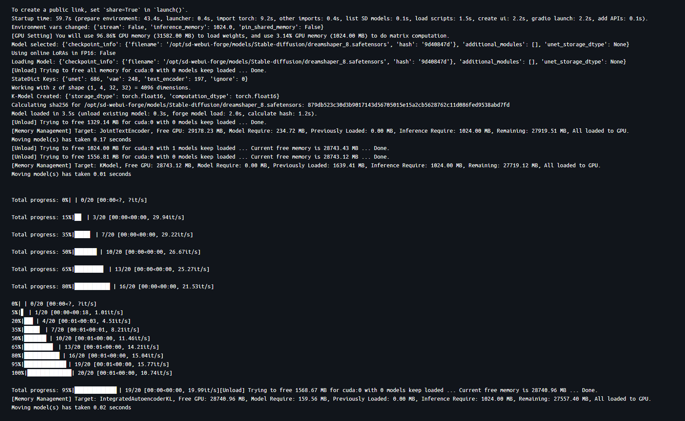

# SD-Comfy-Forge

A unified Docker-based environment for running [ComfyUI](https://github.com/comfyanonymous/ComfyUI) and [Stable Diffusion WebUI Forge](https://github.com/lllyasviel/stable-diffusion-webui-forge) with shared models and outputs. Optimized for NVIDIA RTX 50xx GPUs (CUDA 12.8) and includes built-in [xformers](https://github.com/facebookresearch/xformers) support for improved performance.


## Structure

```
sd-comfy-forge/
├── comfyui/
│   ├── Dockerfile
│   ├── docker-compose.yml
│   └── setup_comfyui_volumes.ps1
├── webui-forge/
│   ├── Dockerfile
│   ├── docker-compose.yml
│   └── setup_forge_volumes.ps1
└── (shared Docker volumes: models, outputs)
```


## Features

- **ComfyUI** and **Forge WebUI** run in isolated containers.
- Shared Docker volumes for models and outputs.
- Automated PowerShell setup scripts for volume creation and initial repository seeding.
- Optimized for NVIDIA GPUs (CUDA 12.8, PyTorch nightly).

# SD-Comfy-Forge

A unified Docker-based environment for running [ComfyUI](https://github.com/comfyanonymous/ComfyUI) and [Stable Diffusion WebUI Forge](https://github.com/lllyasviel/stable-diffusion-webui-forge) with shared models and outputs. Optimized for NVIDIA RTX 50xx GPUs (CUDA 12.8).

# Comfy Result


# Froge Result




## Prerequisites

- [Docker](https://www.docker.com/) with NVIDIA Container Toolkit.
- Windows PowerShell (for setup scripts).
- NVIDIA RTX 50xx GPU (or compatible with CUDA 12.8).


## Quick Start

### 1. Prepare Docker Volumes and Seed UI Code

Open PowerShell and run the setup script for the desired UI:

**For ComfyUI:**
```powershell
cd comfyui
.\setup_comfyui_volumes.ps1
```

**For Forge WebUI:**
```powershell
cd webui-forge
.\setup_forge_volumes.ps1
```

These scripts will:
- Ensure required Docker volumes exist.
- Clone the latest UI code into the appropriate volume (if not already present).
- Build the Docker image.
- Start the container.


### 2. Access the UIs

- **ComfyUI:** [http://localhost:8188](http://localhost:8188)
- **Forge WebUI:** [http://localhost:7860](http://localhost:7860)


## Shared Volumes

- `sd-shared-models`: Place your models here to be accessible by both UIs.
- `sd-shared-output`: Generated images/outputs are stored here.
- `sd-comfyui` / `sd-forge`: Persistent storage for each UI's code and configs.


## License

This project provides Docker orchestration and setup scripts. The UIs themselves are under their respective upstream licenses.